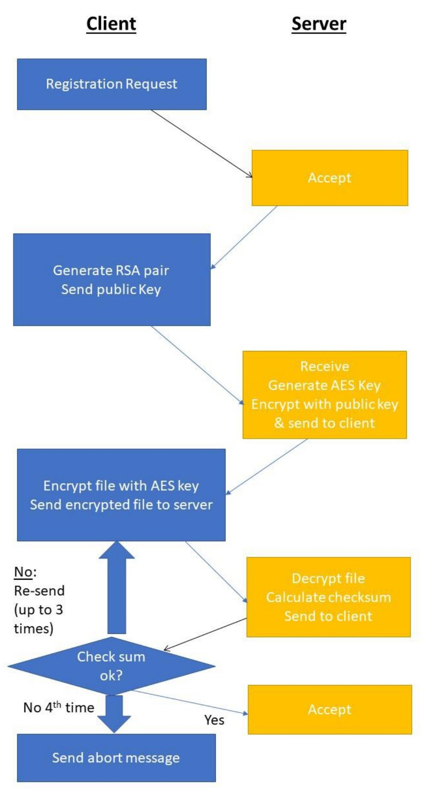
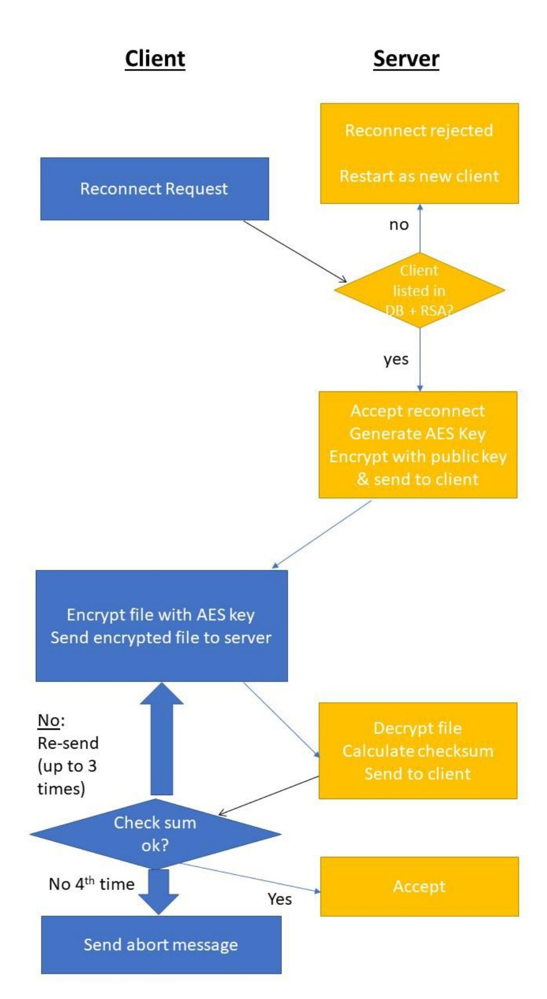

# (Semi) Secure File Transfer System :lock:

The Secure File Transfer System is designed to facilitate secure file transfers between clients and a server. It allows clients to register in a database, exchange encryption keys, and securely send files to the server. The system operates in a client-server architecture and attempts to ensure data confidentiality and integrity during file transmission.

This is the final project I completed as part of the course [Defensive System Programming (20937)](https://www-e.openu.ac.il/courses/20937.htm) at the Open University of Israel.

The project implements a partially secure file transfer protocol designed for transferring relatively small files. The server is written in Python 3.9, the client is written in C++11, and the database is managed with MySQL.

The full project specifications can be found [here](readme/project_specifications.pdf) (Hebrew).

## Table of Contents
- [Features](#features)
- [Communication Protocol](#communication-protocol)
- [Encryption](#encryption)
- [Payload Content](#payload-content)
- [Vulnerabilities and Weaknesses](#vulnerabilities-and-weaknesses)
- [Requirements](#requirements)
- [Getting Started](#getting-started)

## Features

### Registration
- If the client does not have a registration file (`me.info`), it will read user information from the transfer file (`transfer.info`) and send a registration request to the server.
- The server responds with a unique client ID, which the client stores in `me.info`.

### Public Key Generation
- Clients generate RSA key pairs (public and private keys) and send their public key to the server.
- The server uses the received public key to encrypt and send an AES key back to the client.

### File Transfer
- After receiving the AES key, the client decrypts it using its private RSA key and uses it to encrypt the file it wants to send.
- The encrypted file is then sent to the server.
- Both the client and server calculate the CRC of the file for integrity verification.

### Error Handling
- In case of server errors, the client retries sending the message up to three times.
- If unsuccessful, the client exits with a detailed "Fatal" message.

## Communication Protocol

### How the Server Works

1. The server reads the port number from the `port.info` file to determine the port on which it should listen.

2. It listens for incoming connection requests from clients.

3. Upon establishing a connection with a client, the server handles various client requests and actions, including registration, file transfers, and re-connect requests.

4. To manage client and file information, the server interacts with a database. It stores details about clients, such as their UUIDs, public keys, and last seen timestamps. Additionally, it maintains data regarding files, including file names, paths, and verification status.

5. When a client requests to send a file, the server receives the file content, performs cryptographic operations to decrypt and verify the file's integrity using CRC, and then stores the file in the appropriate location.

6. The server communicates with clients using a binary communication protocol, responding to various request codes and sending appropriate responses.

7. Robust error handling and validation mechanisms are implemented to ensure the security and integrity of the system.

### How the Client Works

1. The client reads the server's information, such as its IP address and port, from the `transfer.info` and `me.info` files.

2. It establishes a connection with the server using the provided server IP and port.

3. The client reads its own information from the `me.info` file, including the file name of the executable to run.

4. The client then enters batch mode, executing the specified executable and preparing to send data to the server.

5. The client uses the CryptoPP library to perform cryptographic operations, including encryption and signing, on the data it intends to send to the server.

6. It constructs a binary packet, adhering to the communication protocol, and sends it to the server over a TCP connection.

7. The client may send various types of data to the server, such as file transfers, requests for information, and error responses.

8. Error handling and validation mechanisms are implemented to handle server responses and ensure the reliability of the communication.

9. The client may use a UUID as a unique identifier when communicating with the server.

10. Data sent to the server is packaged, and special attention is given to endianness during data transmission.

11. The client handles errors and responses from the server and maintains communication integrity.


### Here is a chart flow of a registration request:




### And here's what a reconnect looks like:




## Encryption

- **Symmetric Encryption**: CBC-AES with a 128-bit key length is used for symmetric encryption of file content. Initialization Vectors (IVs) are assumed to be zero-filled.
  
- **Asymmetric Encryption**: RSA with 1024-bit key length is used for asymmetric encryption, primarily for exchanging encryption keys between clients and the server.

## Payload Content

The payload content varies depending on the type of request/response. Each payload has a different structure.

### *Client Requests:*

Requests to the server have a structured format combined of both:

#### Request Header
Field      | Meaning
-----------|--------
ID Client  | Unique identifier for each client (128 bits).
Version    | Client version number.
Code       | Request code.

*&*

#### Request Payload Content
Field      | Meaning
-----------|--------
payload    | Variable - Request content, varies depending on the request.


#### Request 1100 – Registration
Field   | Meaning
--------|--------
Name    | ASCII string representing the user's name, including a null terminator character (null-terminated).

* Note: The server ignores the ID Client field.

#### Request 1101 – Public Key Transmission
Field      | Meaning
-----------|--------
Name       | ASCII string representing the user's name, including a null terminator character (null-terminated).
Key Public | Client's public key.

#### Request 1102 – Re-login (if the client has registered before)
Field   | Meaning
--------|--------
Name    | ASCII string representing the user's name, including a null terminator character (null-terminated).

#### Request 1103 – File Transmission
Field           | Meaning
----------------|--------
Name File       | Name of the sent file.
Content Message | Variable content of the file, encrypted using a symmetric key.

#### Request 1104 – Valid CRC
Field   | Meaning
--------|--------
Name File | Name of the sent file.

#### Request 1105 – Invalid CRC, Resend (after Request 1103)
Field   | Meaning
--------|--------
Name File | Name of the sent file.

#### Request 1106 – Invalid CRC for the Fourth Time, Giving Up
Field   | Meaning
--------|--------
Name File | Name of the sent file.

### *Server Response:*
Field         | Meaning
--------------|--------
Header        | Header information.
Version       | Server version number.
Code          | Response code.
size Payload  | Size of the response payload.
Payload       | Variable response content based on the response code.

#### Response 2100 – Successful Registration
Field    | Meaning
---------|--------
ID Client| Unique client identifier.

#### Response 2101 – Registration Failed
Field    | Meaning
---------|--------
ID Client| Unique client identifier.

#### Response 2102 – Received Public Key, Sending Encrypted AES Key
Field          | Meaning
---------------|--------
ID Client      | Unique client identifier.
Symmetric Key  | Encrypted symmetric key for the client.

#### Response 2103 – File Received Successfully with CRC
Field           | Meaning
----------------|--------
ID Client       | Unique sender client identifier.
Size Content    | Size of the received file (after decryption).
Name File       | Name of the received file.
CRC             | Checksum.

#### Response 2104 – Message Acknowledged, Thank You
Field    | Meaning
---------|--------
ID Client| Unique client identifier.

#### Response 2105 – Approving Re-login Request, Sending Encrypted AES Key (Same as Code 2102)
Field          | Meaning
---------------|--------
ID Client      | Unique client identifier.
Symmetric Key  | Encrypted symmetric key for the client.

#### Response 2106 – Re-login Request Denied (Client Not Registered or Invalid Public Key)
Field    | Meaning
---------|--------
ID Client| Unique client identifier.

#### Response 2107 – General Server Error (Unhandled Cases, e.g., Disk Space Exhausted or Database Failure)
Field    | Meaning
---------|--------
ID Client| Unique client identifier.

## Vulnerabilities and Weaknesses

| Vulnerability                       | Description                                                                                          | Solution                                                                                                                                                                                                                                                                 |
|-------------------------------------|------------------------------------------------------------------------------------------------------|---------------------------------------------------------------------------------------------------------------------------------------------------------------------------------------------------------------------------------------------------------------------------|
| Server Crash                        | Attacker may cause a deliberate server crash that will corrupt database or take down the server.                   | Vulnerabilities in server.py and server.db were addressed to prevent server crashes. Proper error handling and input validation mechanisms were implemented to prevent crashes caused by unexpected inputs or situations.                                                                          |
| DDoS Attacks                        | The attacker can send multiple requests, potentially leading to a server crash due to request overflow or causing the operating system to crash by overwhelming it with a large number of files until available storage is exhausted.              | Measures were taken to mitigate the risk of Distributed Denial of Service attacks as much as a simple project like this allows by limiting connections per IP and files amount permitted per user. Yet, the measures taken are pretty basic and do not protect against any modern attack. Services like Cloudflare would be integrated in a real scenario, to mitigate this sort of attacks.                    |
| Unauthorized Database Access        | SQL injections may allow attacker to gain unauthorized access. Additionallym, if 2 users make a concurrent action on the database, a corruption may happen which potentially can corrupt data.                 | Strong input validation and sanitization techniques were implemented to prevent SQL injection vulnerabilities. Mutual exclusive protectionwas implemented to safeguard against potential data corruption.            |
| Directory Traversal Attack     | Attacker may traverse the server's directory through toxic input.                              | Input validation and sanitization processes were applied to mitigate directory traversal attempts. User access was restricted to approved directories and files only.                                              |
| Buffer/Integer Overflow             | Buffer and integer overflow issues in C++ code.                          | Strict bounds checking and data validation logic were introduced in the C++ code segments. Secure libraries and best practices for buffer management and integer handling were followed to eliminate overflow vulnerabilities of vulnerable methods. For exxample, using ```string``` instead of ```char*```.                        |
| Impersonation                       | Man-in-the-Middle attacks.  | Even though this project is implementing a semi-TLS protocol. the UUID is initially available to an attacker that may listen to the client. As part of this project, a solution was not provided as the specifications of the project didn't stipulate it, but in a real scenario, an encryption of the UUID would be performed as well. |

## Requirements

To successfully use and compile the Secure File Transfer System, you will need the following software and libraries installed:

### For the Python Server:

- **Python**: Ensure you have Python 3.9 or a compatible version installed on your system.

- **Crypto.Cipher**: You will need the Crypto.Cipher library for encryption. You can install it using pip with the following command: ```pip install pycryptodome```.


### For the C++ Client:

- **C++11**: The server is written in C++11, so you'll need a C++11 compatible compiler. Make sure you have a suitable compiler installed.

- **Crypto++ (Version 8.7.0)**: Crypto++ is used for cryptographic operations. You can download and install Crypto++ from the official website: [Crypto++ Library (Version 8.7.0)](https://www.cryptopp.com/release870.html).

- **Boost C++ Libraries (Version 1.81.0)**: Boost provides a wide range of useful C++ libraries. In this project it is used for the network handling. You can download and install Boost from the official website: [Boost C++ Libraries (Version 1.81.0)](https://www.boost.org/users/history/version_1_81_0.html).


## Getting Started

To use the project, follow these steps:

1. Compile the client program using C++.

2. Ensure that the `info.transfer` file is properly configured with the server's IP address, port number, client name, and file path.

3. The Python server should also be running and configured to communicate with clients.

4. Run the client program to register with the server (if not registered) or perform other file transfer operations.

